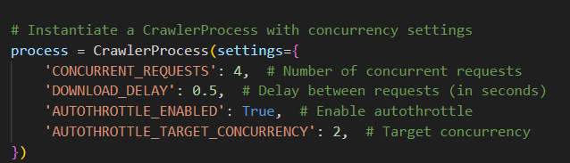

# Abstract: 
This project introduces an integrated system aimed at intelligent web content analysis, crafted by integrating a web crawler, indexer, and Flask-based app processor. Utilizing the Scrapy library, our web crawler efficiently gathers data from various web sources, ensuring comprehensive coverage. Next, leveraging the scikit-learn-powered Indexer library, we organize this data, extracting crucial insights and structuring it for easy retrieval. The Flask-based app processor offers a user-friendly interface for querying and analyzing indexed data, providing users with real-time insights and actionable information. The system streamlines data acquisition, indexing, and analysis processes, empowering users to make informed decisions based on the vast wealth of web content available. The project was then tested with test cases, user input, corpus changes, and finally different wikipedia websites. 

# Overview: 
The development of this project began with the crawler and working with scrapy. The first objective was to setup the crawler so that it can crawl any link given and is able to have a max depth as well. The objectives for the crawler were to: develop the crawler using scrapy, create a function to track the number of pages/items crawled, and to make sure to have stop methods for if the max pages were reached. Additionally, the "20crawl" presentation was consulted to learn basic crawler ideas and also learn about "spider traps". The actual logic of the crawler and indexer (high priority links, back queues) were also considered from the Introduction to Information Retrieval Chapter 20 textbook by Manning, Raghavan, and Shutze. This chapter consisted of relevant information such as text classificiation and index construction with a crawler. At its core lies a web crawler poised to navigate different webpages, seamlessly interfacing with an indexer to catalog harvested data. Finally, this is then used to process queries or even pull information in the app. 

# Design: 
System Capabilities: 
*Crawler*
*Crawler - The crawler uses the Scrapy 2.11 library and creates a spideris crucial for the system to be able to download information. Given any seed URL the HTML content of the web page is able to be retreived. This can be any relevant data like paragraphs of text. The crawler also crawls onto other links on the page and can keep going.
*Depth Limit - This is used for 'max_depth' to control how many links the crawler will crawl. It is too prevent overflow. After the target depth is reached it will not continue forward. 
*Page Limit - This is used for 'max_pages" control how many pages the crawler can crawl. After the limit is reached the crawling will end. 
*Concurrency Crawling - This optional system requirement was achieved by using Scrapy's concurrency settings 'CONCURRENT_REQUESTS' and using 'DOWNLOAD_DELAY'.

*Autothrottle - Autothrottle adjusts the crawling speed based on the computer and server's response time. Too many requests will lead to overloading. 

*Indexer*
*Text Indexing - Indexer that uses TF-IDF vectorization 
*Add Document - 'add_document' to add documents to the index. 
*Index Builder - 'build_index' to build the index based on the document added
*Searching - The goal of this method is to retreive the most documents given a query based on cosine similarity between tf-idf vectors. 

*App*
*Web App - Uses flask to create an interface to submit queries and get results
*Query Processing - Processes quereies and returns results 
*Spelling correction - Catches errors using wordnet and edit distance 

Interactions: 
*Crawler*
*Parse: The parse method is used for each crawled page and inside the method the data extraction occurs. 
*Follow links: This is used to follow links on each page and uses the Scrapy's 'response.follow' method to achieve it. 

*Indexer*
*TF-IDF Interactions: Used to conert document text to vectors for searching through indexing. 
*Cosine Similarity: Computes the cosine similarity from the query vecctor and TF-IDF
*Serialization: Uses PICKLE to serialize and deserialize the object index. 

*App*
*Flask Routes: Uses /query, /search to handle the different requests
*Query Expansion - Expands user queries with synonyms obtained from WordNet. 
*Index Interaction - Is able to use the indexer from the indexer class to load documents, searches
*HTTP Requests - POST and GET requests for queries and search. 

Integrations:
*Crawler*
*Scrapy Framework - Basic web crawling
*CrawlerProcess - Start and Stop
*Spider - The MySpider class, defines how the spider can intereact with webpages and data. 
*Callbacks (ex. Parse)

*Indexer*
*Sckit-learn - Uses the sckit-learn library with 'tfidfvectorizer' for text vectors and cosine similarity to compute similarities
*Pickle - Allows you to save python objects to a file or send them into memory, load them into memory, transfer data. 

*App* 
*Flask Framework
*NLTK Library - Able to use wordnet for spelling correction and query expansion
*Indexer - Integrated with the 'Indexer' class for searching

# Architecture: 
*Crawler*
The architecture for the crawler uses spider, parsing, crawling logic, and a crawling process to account for concurrent requests. The crawler is created in that order specifically. Firstly, the libraries are imported (scrapy, crawlerprocess) and then the spider class is created. This is where the initial URL and max_pages/max_depth are set and able to be changed later. Next, the parsing method. This method shows the spider how it should extract data from the webpage: extracting links and text data from paragraphs. Then the the data is put into a dictionary titled "yield". Next we have the crawling logic. This logic is crucial because it counts the number of items (links) and if the spider is under the maxpages and depth. If that is true it will continue to crawl, otherwise the crawling will stop. This area also manages the depth. Finally, the crawler has an object with particular setings for concurrency, download delay, and autothrottle. These optional features were added to prevent the system from overloading or the server. 

*Indexer* 
The architecture for the indexer is the indexer class, add method, index builder, index loader, search method, and finally a usage area. The indexer class intiializes the tfidfvectorizer and also has an empty list of documents. The add_document method simply is a method to add documents to the indexer by adding it to the documetns list. The index builder uses the vectorizer method to add to the indexer so that it can learn the idf-weights. The saving index method is to save the index to a pickle so it can be accessed again later. The search method is able to take a query as an input and return the similar documents in the index -- using cosine similarity. The code first runs a test that the index is created, then gets the tf-idf vector and can compute the cosine similarity between the query vector and the other vectors. Finally, the usage part of the architecture adds a document, builds th eindex, saves it, loads the file, adds another doc, and searches based on the query. This will print the top-k search results. I was able to consult chatgpt for areas I was unsure or errors I encoutered.  

*App*
The architecture uses Flask for web development, NLTK, and machine learning libraries like Scikit-learn to create a search engine that is able to handle spelling correction and query expansion. Additionally, those components are able to handle retrieving relvant search results from the indexed corpus, and has the query expansion capabilities using wordnet. 

# Operation: 
To run the crawler use the command python -m scrapy runspider crawler.py -o output.json
*In order to change the website change the URL in cthe crawler file and also max pages and depth*
To make the index use the command python indexer.py
To search the index use the command python App.py
You will be able to search the index using the search bar. 

All the required libraries will need to be installed: scrapy, sklearn, pickle, flask, nltk, indexer

# Conclusion: 
Overall, this project was very complicated and required a lot of research and devlopment. However, I was able to find a lot of success in creating the spider using scrapy, working with the indexer. One failure I had was building the app. I ran into a lot of errors with the query processor and how to make sure the query worked and if it will be corrected. Another failure I had was working with spider and making sure it followed the correct number of pages/depth. This was fixed by using the response.meta.get method but was still an issue for a while. Another failure I ran into was the entire creation of the app. This app works on and off and if I were given more time I would further optimize/test it. Some success  I had in this project was correct spelling optional requirement. This was my first time working with wordnet, but the library is suprisingly straightforward. Another success I had was with creating the indexer and making it operational. 
# Data Sources: 
Test sources: 
https://en.wikipedia.org/wiki/Main_Page
https://en.wikipedia.org/wiki/Portal:Current_events
https://en.wikipedia.org/wiki/Wikipedia:Contents

# Source Code: 
indexer.py
crawler.py
app.py
scikit-learn
pickle
scrapy
flask - request, jsonify for output
nltk
pairwise_distances
edit_distance
wordnet

# Bibliography: 
Christopher Manning, Prabhakar Raghavan, Hinrich Schutze. "An Introduction to Information Retrieval" Cambridge University Press
Scrapy developer "https://docs.scrapy.org/en/latest/topics/practices.html/" 2008-2024
freeCodeCamp.org. "Scrapy Course - Python Web Scraping for Beginners" https://www.youtube.com/watch?v=mBoX_JCKZTE, YouTube, April 27, 2023
John Watson Rooney. "Scrapy for Beginners - A Complete How to Example Web Scraping Project", https://www.youtube.com/watch?v=s4jtkzHhLzY, YouTube, December 9, 2020
freeCodeCamp.org. "Learn Flask for Python - Full Tutorial", https://www.youtube.com/watch?v=Z1RJmh_OqeA, YouTube, May 28, 2019
The Python Software Foundation, "pickle - Python object serializaiton", https://python.readthedocs.io/en/latest/library/pickle.html, November 15, 2017
scikit-learn developers, "sklearn.feature_extraction.text.TfidfVectorizer", https://scikit-learn.org/stable/modules/generated/sklearn.feature_extraction.text.TfidfVectorizer.html, 2007 - 2024
scikit-learn developers, "sklearn.metrics.pairwise.cosine_similarity", https://scikit-learn.org/stable/modules/generated/sklearn.metrics.pairwise.cosine_similarity.html, 2007 - 2024
https://github.com/elementor/wp2static/discussions/762
OpenAI. (2023). ChatGPT (Apr 20 version) [Large language model]. https://chat.openai.com/chat

